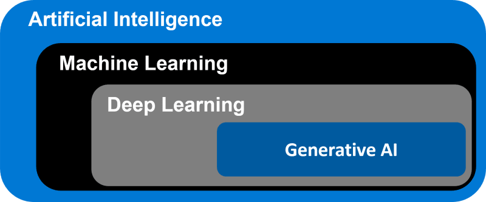

# artificial-intelligence
artificial intelligence, machine learning, deep learning, generative AI  

### Generative AI Use Cases
	Image Synthesis.
	Super-Resolution.
	Image-To-Photo Translation.
	Video Prediction.
	Text Generation and Personalized Content Creation.
	Sentiment Analysis, Text Classification.
	Code Generation, Review, Debugging, and Style Check.
	Data Synthesis.
	Text-To-Speech Generator
	Music Generation 
	Drug Discovery And Development
	Genetics Research
	Enhanced Medical Imaging
	Creative Fashion Designing For Designers
	Generating Fashion Models
	Fashion Industry Market And Trend Analysis 
	Personalized Lessons, Course Planning, And Design
	Content, Image, And Video Creation For Lessons
	Tutoring  
	Fraud Detection
	Risk Management
	Contract Generation And Compliance
	Supply Chain Management And Demand Forecasting
	Identity Verification
	Destination Recommendations

### Resources
	3:26 - Programming (Python)
	5:09 - Git
	6:16 - APIs
	7:03 - Neural networks
	8:56 - Neural network architectures
	10:08 - Text embeddings & vector store
	10:38 - Real-world projects
	11:52 - Mental models & specializations
	13:56 - Extra resources
	
	📖 Google Advanced Data Analytics Certificate 👉 https://imp.i384100.net/anK9zZ
	📖 Google Data Analytics Certificate 👉 https://imp.i384100.net/15v9y6
	📖 Learn SQL Basics for Data Science Specialization 👉 https://imp.i384100.net/AovPnJ
	📖 Excel Skills for Business 👉 https://coursera.pxf.io/doPaoy
	📖 Machine Learning Specialization 👉 https://imp.i384100.net/RyjykN
	📖 Data Visualization with Tableau Specialization 👉https://imp.i384100.net/n15XWR
	📖 Deep Learning Specialization 👉 https://imp.i384100.net/zavBA0
	📖 Mathematics for Machine Learning and Data Science Specialization 👉 https://imp.i384100.net/LXK0gj
	📖 Applied Data Science with Python 👉 https://imp.i384100.net/gbxOqv

